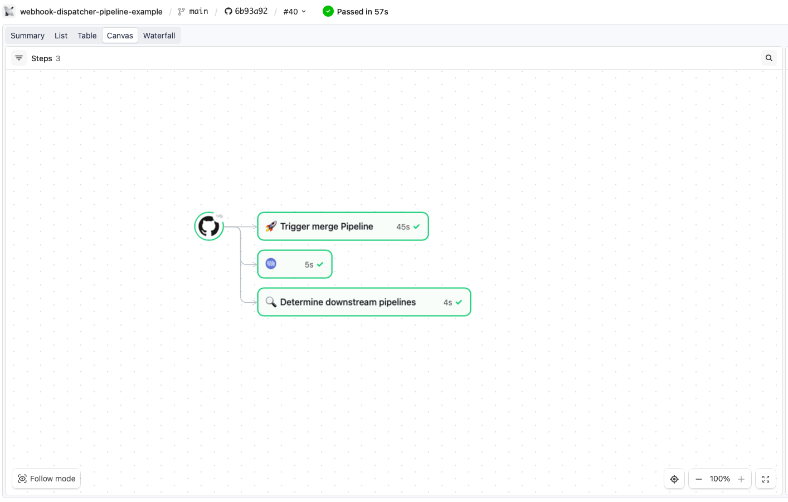
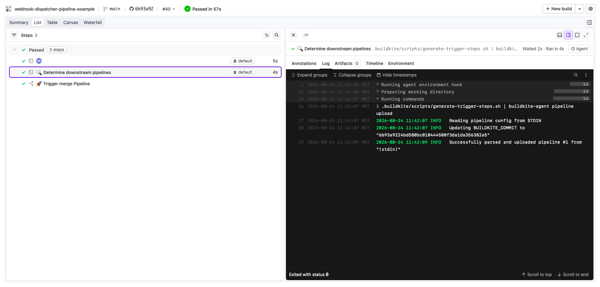
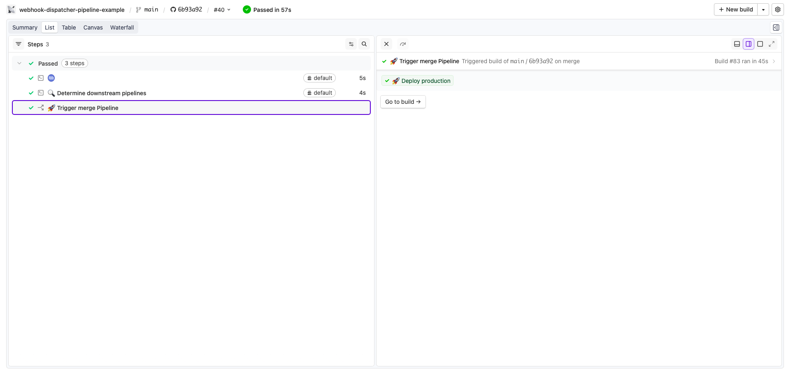

# Buildkite Webhook Dispatcher Pipeline Example

[](https://buildkite.com/buildkite/webhook-dispatcher-pipeline-example)
[](https://buildkite.com/new)

Buildkite's [GitHub webhook integration](https://buildkite.com/docs/pipelines/source-control/github) is 1:1, each pipeline that wants to build automatically on push needs its own webhook on the repo, and GitHub caps a repo at 20 webhooks. 

This repository is an example pipeline that works around it, by fanning a single webhook out to many downstream pipelines.

👉 **See this example in action:** [buildkite/webhook-dispatcher-pipeline-example](https://buildkite.com/buildkite/webhook-dispatcher-pipeline-example)

See the full [Getting Started Guide](https://buildkite.com/docs/guides/getting-started) for step-by-step instructions on how to get this running, or try it yourself:

[](https://buildkite.com/new)

<a href="https://buildkite.com/buildkite/webhook-dispatcher-pipeline-example/builds/latest?branch=main">
  
</a>
<a href="https://buildkite.com/buildkite/webhook-dispatcher-pipeline-example/builds/latest?branch=main">
  
</a>
<a href="https://buildkite.com/buildkite/webhook-dispatcher-pipeline-example/builds/latest?branch=main">
  
</a>

<!-- docs:start -->

## Repository layout

```
.
├── .buildkite/
│   ├── screenshots/
│   │   ├── screenshot.png
│   │   ├── screenshot-1.png
│   │   └── screenshot-2.png
│   ├── scripts/
│   │   └── generate-trigger-steps.sh   # reads routes.conf + git diff, emits `trigger` steps
│   ├── pipeline.yml                    # dispatcher — the ONLY pipeline with a GitHub webhook
│   ├── routes.conf                     # path → pipeline routing table (edit this)
│   └── template.yml                    # powers the "Add to Buildkite" button
├── services/
│   ├── service-a/
│   │   ├── .buildkite/
│   │   │   └── pipeline.yml            # downstream pipeline #1 (no webhook)
│   │   └── README.md                   # service-a overview
│   └── service-b/
│       ├── .buildkite/
│       │   └── pipeline.yml            # downstream pipeline #2 (no webhook)
│       └── README.md                   # service-b overview
├── LICENSE                             # MIT license
└── README.md                           # this file
```

## How it works

It uses a dispatcher pipeline as the single point of contact with GitHub, and fans out to as many downstream pipelines as needed. Only the dispatcher consumes a webhook slot, so the webhook limit no longer scales with pipeline count:

```
GitHub push/PR
      │
      ▼
┌─────────────────────┐
│ dispatcher pipeline │  ← the ONLY pipeline with a GitHub webhook
└─────────┬───────────┘
          │ diffs the changed paths, decides what's affected
          ▼
   ┌──────────────┬──────────────┐
   ▼              ▼              ▼
service-a      service-b     (…any number more)
(no webhook)   (no webhook)   (no webhook)
```

Which downstream pipelines actually get triggered is controlled entirely by `.buildkite/routes.conf`. Each line maps a path in this repo to the slug of the pipeline that should be triggered when something under that path changes.

For example, if nothing under `services/service-a/` changed, **service-a-pipeline** doesn't run. But if there was a change to `services/service-b/` then **service-b-pipeline** will be triggered.

```
services/service-a:service-a-pipeline
services/service-b:service-b-pipeline
```

## Adding a service

Each line in `.buildkite/routes.conf` maps a watched path to a downstream pipeline:

To add a service:

1. Add a `<watched-path>:<pipeline-slug>` line to `routes.conf`.
2. Create a Buildkite pipeline with that slug, using this repo, and upload the steps from the service's `.buildkite/pipeline.yml`.

If you're running this example in your own organization, create `service-a-pipeline` and `service-b-pipeline` this way first. Otherwise the dispatcher's trigger steps will fail.

## License

See [LICENSE](LICENSE) (MIT)
